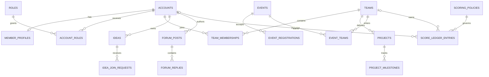

# Common backend data model

**Status:** accepted baseline for backend implementation.  
**Local engine:** SQLite 3.45 or newer.  
**Migration target:** managed PostgreSQL when concurrency or operational needs
outgrow a single-node database.

The executable source of truth is
[`../migrations/001_initial.sqlite.sql`](../migrations/001_initial.sqlite.sql).
Earlier domain schema documents remain requirement records; where they differ,
the versioned migration wins.

## Architecture decision

CVS Garage is one backend deployable, so local development uses one relational
database rather than a database per frontend area. This preserves foreign keys
and transactions for workflows spanning Member Centre, Projects, Events, Idea
Centre, Forum, and Leaderboards. Table prefixes and ownership rules preserve
domain boundaries without pretending the current modules are microservices.



## Domain ownership

| Owner | Canonical relations |
| --- | --- |
| Member Centre | `accounts`, member/organization profiles, roles, permissions, sessions, tokens, invitations, mentor applications |
| Shared backend | departments, academic years, media assets, teams, notifications, activity log, integration outbox |
| Projects | pitches and feedback, projects, milestones, updates, reviews, change requests, showcases |
| Events | events, subtracks, schedule, prizes, judges, registrations, teams, check-ins, placements |
| Idea Centre | tracks, tech tags, ideas, idea membership, join/mentor requests, comments, bookmarks |
| Forum | categories, communities, posts, replies, tags, votes, bookmarks, follows, exports, reports, moderation |
| Leaderboards | scoring policies, score ledger, achievements, snapshots and snapshot entries |

A module may read another owner's public projection through a repository or
service interface. It must not update another domain's tables directly. A
cross-domain workflow updates its own rows and `integration_outbox` in one
transaction; the consumer deduplicates on `idempotency_key` or `source_key`.

## Common model rules

- IDs are opaque application-generated `TEXT` values. Generate UUIDv7 for new
  records; existing readable fixture IDs remain valid during migration.
- Timestamps are UTC RFC 3339 strings. SQLite `CURRENT_TIMESTAMP` defaults are
  UTC but omit the offset; API serializers must return RFC 3339 with `Z`.
- Booleans are `INTEGER` constrained to `0` or `1`.
- Structured payloads are JSON text guarded by `json_valid`. Application code
  parses and validates their documented shape before use.
- Email uniqueness is case-insensitive and applies only to non-deleted accounts.
- User-facing mutable records use `deleted_at`; financial-style score facts and
  audit records are corrected by revocation or compensation, never overwritten.
- Foreign keys are enabled on every connection. Use `RESTRICT` for historical
  records, `CASCADE` only for true children, and `SET NULL` for optional context.
- Counters such as forum vote totals are cached projections. Update their source
  row and normalized fact in one transaction; periodically reconcile them.
- Every mutation takes an authenticated request context and enforces role,
  permission, ownership, current status, and resource scope on the server.
- Secrets, password hashes, token hashes, private profile fields, and audit
  metadata never appear in public DTOs or logs.

## Cross-domain invariants

1. `accounts` is the only identity source. Domain tables reference `account_id`;
   they do not copy users or trust role values supplied by clients.
2. `teams` and `team_memberships` are shared references used by Projects,
   Events, and Leaderboards. Project-specific workflow authority still comes
   from project state and active team membership.
3. A Forum-to-Idea export is one-to-one. `forum_idea_exports` and
   `ideas.source_forum_post_id` both prevent duplicate conversion.
4. Leaderboard writes are append-only and idempotent. Exactly one of member or
   team is the score subject. Corrections set `revoked_at` or append an inverse
   entry under a new source key.
5. Event placements are final facts and must be written in the same transaction
   as outbox events that award scores or create achievements.
6. Audit writes for privileged or state-changing actions share the transaction
   with the mutation. `activity_log` has database triggers blocking update and
   delete.
7. Idea comment depth, accepted Forum reply ownership, project transition
   guards, event capacity, and overlapping scoring-policy periods require
   transactional service checks because simple row constraints cannot express
   those rules completely.

## Transaction boundaries

Use one transaction for each command, not each SQL statement. Important command
boundaries include:

- role grant/revoke plus activity entry;
- pitch approval plus team/project creation and activity entry;
- join-request acceptance plus idea membership and notification;
- mentor claim plus idea assignment and notification;
- vote replacement plus aggregate counter update;
- accepted answer plus post/reply state and leaderboard outbox event;
- event finalization plus placements and scoring outbox events.

SQLite permits one writer at a time. Keep write transactions short, use prepared
statements, and never perform network calls while a transaction is open.

## Local database lifecycle

From `backend` with Node 22.13 or newer:

```powershell
Copy-Item .env.example .env
npm run db:migrate
npm run db:check
npm test
npm start
```

The default file is `backend/.data/cvs-garage.sqlite`; local database, WAL, and
shared-memory files are ignored by Git. Set `DATABASE_PATH` to use another file.
Never commit database files, backups, credentials, or real student data.

Migration files are immutable after merge. Add the next zero-padded migration,
wrap it in a transaction, and insert its own `schema_migrations` row. Back up a
non-development database before applying it. SQLite DDL rollback is restore from
the verified backup plus application rollback; do not write destructive down
migrations that imply lost data can be recreated.

## Managed service migration

Keep repositories parameterized and free of SQLite-specific SQL outside the
database layer. The expected managed target is PostgreSQL. Migration requires:

1. translate JSON text to `jsonb`, booleans to `boolean`, timestamps to
   `timestamptz`, and IDs to `uuid` only after all current IDs are convertible;
2. replace `COLLATE NOCASE` email handling with `citext` or a lower-case unique
   index and replace partial-index syntax where required;
3. reproduce checks, foreign keys, append-only audit protection, and active-row
   uniqueness in PostgreSQL migrations;
4. dual-test repository behavior against a restored sanitized copy, compare row
   counts and hashes, freeze writes, run the final delta, then switch the
   connection configuration;
5. retain the SQLite backup and a tested fallback release until post-cutover
   integrity, authorization, and critical workflows pass.

Do not introduce dual writes as a shortcut. Use a controlled export/import and
short write freeze unless a later availability requirement justifies a proper
change-data-capture design.

## Deliberate follow-up work

The existing Forum runtime still uses `ForumStore` and mock integration adapters.
Move it behind repository interfaces before replacing its store with SQLite so
the existing HTTP behavior remains testable. Member authentication must then be
implemented from `accounts`, sessions, roles, and permissions before other
modules depend on database-backed authorization.

Before public API implementation, agree DTOs in `packages/contracts`. Database
rows are not API contracts, and public projections must exclude private fields.