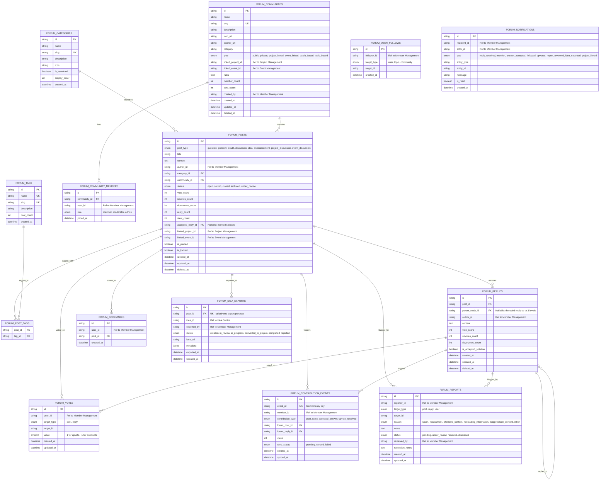

# CVS Garage — Forum Service Architecture & Database Schema
**Document Version:** 1.0.0  
**Author:** Principal Software Engineer & Solution Architect  
**Service:** Forum & Discussions (`services/forum` & `backend/src/modules/forum`)  
**Design Tokens:** Primary Theme: Orange (`#EA580C` / `#F97316`), Typography: Google Sans  

---

## 1. System Architecture

### 1.1 Ecosystem Context & Bounded Contexts
The Forum operates as the central conversational and knowledge-transfer layer within the CVS Garage college innovation platform. It bridges member questions with idea incubation, project execution, event collaboration, and leaderboard recognition.

```
                         ┌─────────────────────────────────────────┐
                         │       MEMBER MANAGEMENT (Identity)       │
                         │   Auth, Roles, Mentors, Profiles (SSO)  │
                         └────────────────────┬────────────────────┘
                                              │ JWT / User Claims
                   ┌──────────────────────────┼──────────────────────────┐
                   ▼                          ▼                          ▼
        ┌────────────────────┐     ┌────────────────────┐     ┌────────────────────┐
        │    IDEA CENTRE     │     │       FORUM        │     │ PROJECT MANAGEMENT │
        │  Ideas, Pitches,   │◄────┤  Discussions, Q&A, │────►│  Projects, Teams,  │
        │  Reviews, Approval │     │  Communities, Tags │     │  Milestones, Repos │
        └─────────┬──────────┘     └──────────┬─────────┘     └─────────┬──────────┘
                  │                           │                         │
                  │ "Export to Idea"          │ Contribution Events     │ Project-linked
                  │ (Bi-directional Link)     │ (Idempotent)            │ Discussions
                  ▼                           ▼                         ▼
        ┌──────────────────────────────────────────────────────────────────────────┐
        │                           EVENT MANAGEMENT                               │
        │            Hackathons, Tech Fests, Competitions, Workshops              │
        └─────────────────────────────────────┬────────────────────────────────────┘
                                              │
                                              ▼
                             ┌───────────────────────────────────┐
                             │       RANKING & LEADERBOARD       │
                             │  Gamification, Badges, Reputation │
                             └───────────────────────────────────┘
```

### 1.2 Architectural Principles
1. **Zero Database Ownership Pollution:** Forum owns discussion entities (posts, replies, votes, bookmarks, tags, communities, moderation, reports). It **never** owns or duplicates Member, Project, Event, Idea, or Leaderboard tables.
2. **Loosely Coupled Integration Adapters:** External services are accessed via well-typed interface boundaries (`IMemberService`, `IProjectService`, `IEventService`, `IIdeaCentreService`, `ILeaderboardService`). Forum ships with robust mock adapters for autonomous local execution and seamless plug-and-play HTTP adapters for production deployment.
3. **Idempotent Cross-Module Side Effects:**
   - **Idea Centre Export:** Atomic tracking table `forum_idea_exports` with a `UNIQUE(post_id)` constraint prevents accidental multiple exports.
   - **Leaderboard Contributions:** Normalized `forum_contribution_events` table with compound unique index `(member_id, contribution_type, forum_post_id, forum_reply_id)` guarantees zero double-counting.
4. **Normalized Voting & Scalable Aggregations:** Individual votes are recorded in a normalized `forum_votes` table. Materialized score counters on posts and replies are updated through atomic database transactions to eliminate race conditions.
5. **Multi-Tenant Monorepo Layout:**
   - Central Backend: `backend/src/modules/forum/` routes, controllers, services, repositories.
   - Central Database: `backend/database/schema/forum.sql` and `backend/database/seeds/forum_seed.sql`.
   - Shared Contracts: `packages/contracts/src/forum/`.
   - Forum Application Frontend: `services/forum/` with Google Sans typography and Orange styling.

---

## 2. Forum Database ERD & Schema

### 2.1 Entity Relationship Diagram (Mermaid)



### 2.2 Table Schemas & Constraints (SQL-Ready)

#### Indexing Strategy:
- `forum_posts(status, created_at DESC)` for high-throughput feed queries.
- `forum_posts(community_id, created_at DESC)` for community timelines.
- `forum_posts(linked_project_id)` and `forum_posts(linked_event_id)` for cross-module bidirectional retrieval.
- `forum_votes(user_id, target_type, target_id)` with `UNIQUE` constraint to guarantee 1 vote per user per target.
- `forum_bookmarks(user_id, post_id)` with `UNIQUE` constraint.
- `forum_idea_exports(post_id)` with `UNIQUE` constraint to eliminate duplicate exports.
- `forum_contribution_events(member_id, contribution_type, forum_post_id, forum_reply_id)` with `UNIQUE` constraint to prevent double-counting.
- Full-text search index (GIN/GiST) on `forum_posts(title, content)`.

---

## 3. API Architecture

### 3.1 Standard Response Envelope
All Forum APIs follow a consistent, enterprise-grade response structure:

```typescript
export interface ApiResponse<T> {
  success: boolean;
  data: T | null;
  error?: {
    code: string;
    message: string;
    details?: unknown;
  } | null;
  meta?: {
    page?: number;
    limit?: number;
    total?: number;
    hasMore?: boolean;
    timestamp: string;
  };
}
```

### 3.2 Endpoint Inventory

| Method | Path | Description | RBAC / Auth |
| :--- | :--- | :--- | :--- |
| **Feed & Posts** | | | |
| `GET` | `/api/v1/forum/posts` | Paginated feed with filters (sort, tag, community, status, linkedProject, linkedEvent, search) | Public |
| `GET` | `/api/v1/forum/posts/:id` | Full post detail with author info, tags, community, export status, accepted reply | Public |
| `POST` | `/api/v1/forum/posts` | Create new post (question, problem, doubt, discussion, idea, etc.) | Authenticated |
| `PATCH` | `/api/v1/forum/posts/:id` | Update post content, tags, category | Author / Mod / Admin |
| `DELETE` | `/api/v1/forum/posts/:id` | Soft delete post | Author / Mod / Admin |
| `POST` | `/api/v1/forum/posts/:id/accept-solution` | Mark reply as accepted solution (transitions post to `solved`) | Post Author / Mod |
| **Replies & Comments** | | | |
| `GET` | `/api/v1/forum/posts/:id/replies` | Threaded replies for a post (nested up to 3 levels) | Public |
| `POST` | `/api/v1/forum/posts/:id/replies` | Post a reply or nested answer | Authenticated |
| `PATCH` | `/api/v1/forum/replies/:id` | Edit reply | Reply Author |
| `DELETE` | `/api/v1/forum/replies/:id` | Soft delete reply | Author / Mod / Admin |
| **Voting & Bookmarks** | | | |
| `POST` | `/api/v1/forum/votes` | Cast, change, or remove vote (`{ targetType: 'post'\|'reply', targetId, value: 1\|-1\|0 }`) | Authenticated |
| `POST` | `/api/v1/forum/bookmarks/toggle` | Toggle bookmark on post | Authenticated |
| `GET` | `/api/v1/forum/bookmarks` | Get current user's saved discussions | Authenticated |
| **Communities** | | | |
| `GET` | `/api/v1/forum/communities` | List all communities with member & post count | Public |
| `GET` | `/api/v1/forum/communities/:slug` | Community details, rules, moderators, linked project/event | Public |
| `POST` | `/api/v1/forum/communities` | Create new community | Admin / Mentor |
| `POST` | `/api/v1/forum/communities/:id/join` | Join/leave community | Authenticated |
| **Mentors & Following** | | | |
| `GET` | `/api/v1/forum/mentors` | Discover available mentors with expertise, badges, answers count | Public |
| `POST` | `/api/v1/forum/follows/toggle` | Follow/unfollow user, topic, or community | Authenticated |
| `GET` | `/api/v1/forum/follows` | List following entities | Authenticated |
| **Search & Tags** | | | |
| `GET` | `/api/v1/forum/search` | Search posts, communities, mentors, tags | Public |
| `GET` | `/api/v1/forum/tags` | List popular and trending tags | Public |
| **Moderation & Reports** | | | |
| `POST` | `/api/v1/forum/reports` | Submit report for post, reply, or user | Authenticated |
| `GET` | `/api/v1/forum/moderation/reports` | Moderator queue of pending/under_review reports | Mod / Admin |
| `PATCH` | `/api/v1/forum/moderation/reports/:id` | Update report status and resolution action | Mod / Admin |
| **Cross-Module Integrations** | | | |
| `POST` | `/api/v1/forum/integrations/idea-centre/export` | Export forum discussion to Idea Centre | Authenticated (Author/Mod) |
| `GET` | `/api/v1/forum/integrations/idea-centre/:postId` | Check idea export status and canonical Idea URL | Public |
| `POST` | `/api/v1/forum/integrations/leaderboard/sync` | Internal batch or webhook sync for contribution events | System / Service Key |

---

## 4. Cross-Module Integration Contracts

To uphold **Rule 9** (External modules accessed via services/APIs rather than DB ownership) and **Rule 44** (Never invent fake private APIs, use explicit interfaces and adapters):

### 4.1 Member Management Contract (`IMemberService`)
Source of truth for authentication, user profiles, mentor badges, and roles:
```typescript
export interface MemberProfile {
  id: string;
  name: string;
  avatarUrl?: string;
  email: string;
  department: string;
  batch?: string;
  role: 'Student' | 'Mentor' | 'Community Moderator' | 'Admin' | 'Organisation' | 'Judge';
  isMentor: boolean;
  mentorExpertise?: string[];
  bio?: string;
  stats?: {
    helpfulAnswersCount: number;
    discussionsCount: number;
  };
}

export interface IMemberService {
  getMemberById(memberId: string): Promise<MemberProfile | null>;
  getMentors(query?: { expertise?: string; department?: string }): Promise<MemberProfile[]>;
  verifyToken(token: string): Promise<{ userId: string; role: string }>;
}
```

### 4.2 Project Management Contract (`IProjectService`)
Source of truth for project entity linking:
```typescript
export interface ProjectSummary {
  id: string;
  name: string;
  slug: string;
  tagline: string;
  status: 'planning' | 'in_progress' | 'showcase' | 'completed';
  leaderId: string;
  membersCount: number;
  tags: string[];
}

export interface IProjectService {
  getProjectById(projectId: string): Promise<ProjectSummary | null>;
  searchProjects(query: string): Promise<ProjectSummary[]>;
}
```

### 4.3 Event Management Contract (`IEventService`)
Source of truth for hackathons, tech fests, and workshops:
```typescript
export interface EventSummary {
  id: string;
  title: string;
  slug: string;
  type: 'hackathon' | 'tech_fest' | 'workshop' | 'webinar';
  startDate: string;
  endDate: string;
  status: 'upcoming' | 'ongoing' | 'completed';
}

export interface IEventService {
  getEventById(eventId: string): Promise<EventSummary | null>;
  searchEvents(query: string): Promise<EventSummary[]>;
}
```

### 4.4 Idea Centre Contract (`IIdeaCentreService`)
Crucial integration point for "Export to Idea Centre":
```typescript
export interface IdeaExportPayload {
  sourceForumPostId: string;
  title: string;
  problemStatement: string;
  proposedSolution: string;
  expectedImpact?: string;
  authorMemberId: string;
  department: string;
  tags: string[];
  techStack?: string[];
  createdAt: string;
}

export interface IdeaExportResult {
  success: boolean;
  ideaId: string;
  ideaUrl: string;
  sourceForumPostId: string;
  status: 'created' | 'in_review' | 'in_progress' | 'converted_to_project' | 'completed' | 'rejected';
  message?: string;
}

export interface IIdeaCentreService {
  exportForumPostToIdea(payload: IdeaExportPayload): Promise<IdeaExportResult>;
  getIdeaStatusByPostId(postId: string): Promise<IdeaExportResult | null>;
}
```

### 4.5 Ranking & Leaderboard Contract (`ILeaderboardService`)
Transmits standardized contribution telemetry without assuming scoring equations:
```typescript
export type ForumContributionType = 'post' | 'reply' | 'accepted_answer' | 'upvote_received';

export interface LeaderboardContributionEvent {
  eventId: string; // Unique idempotency key: e.g., "contrib-post-1234"
  memberId: string;
  contributionType: ForumContributionType;
  forumPostId: string;
  forumReplyId?: string;
  value: number; // typically 1 count
  timestamp: string;
}

export interface ILeaderboardService {
  recordContribution(event: LeaderboardContributionEvent): Promise<{ success: boolean; recordedAt: string }>;
}
```

---

## 5. Frontend Page Map

| Route / View | View Name | Purpose & Primary Actions |
| :--- | :--- | :--- |
| `/` | **Forum Home Feed** | Main dashboard with tabs: All, Trending, Most Discussed, Unanswered, Solved, Following, My Communities. Search bar, New Post CTA, Trending sidebar. |
| `/posts/:id` | **Post Detail & Answers** | Rich post content, voting score, bookmarks, share URL, "Export to Idea Centre" button, Solution badge, threaded replies with accepted answer highlight. |
| `/new` | **Create Post Studio** | Dynamic post composer adapting to type: Question, Problem, Doubt, Idea (structured problem/solution fields), Project/Event linking dropdowns. |
| `/communities` | **Community Hub** | Grid of college tech communities (Web Dev, AI/ML, Robotics, Batch 2026). Join/Leave actions, member counts. |
| `/communities/:slug` | **Community Detail** | Pinned announcements, community discussions feed, rules sidebar, moderator list, community-specific search. |
| `/mentors` | **Mentor Discovery** | Discover college mentors by department & expertise. Filter by tech stacks, view helpful answer counts, "Ask Mentor" prompt. |
| `/bookmarks` | **Saved Discussions** | Personal repository of bookmarked questions and discussions for fast reference. |
| `/members/:id` | **Member Forum Profile** | Forum-specific profile showing reputation, badges, questions asked, solutions accepted, recent activity, follow button. |
| `/search` | **Advanced Search** | Filter by keyword, tag, post status (`solved`), author, linked project/event, and sort order. |
| `/moderation` | **Moderator Portal** | Reports queue for flagged posts/replies. Dismiss, soft-delete, warn, audit log for moderators and admins. |

---

## 6. Component Hierarchy

```
AppShell
├── AppHeader (Brand Logo "CVS Garage Forum", SearchBar, NotificationBell, UserAvatarMenu, NewPostButton)
├── SubNavTabs (Feed, Communities, Mentors, Saved, Moderation)
└── MainContainer (Responsive 3-Column Layout: Sidebar | Feed | InfoPanel)
    ├── LeftNavigationSidebar
    │   ├── NavigationLinkList (Home, Trending, Solved, My Communities, Mentors, Bookmarks)
    │   └── JoinedCommunitiesQuickList
    ├── MainContent
    │   ├── [Route: HomeFeed]
    │   │   ├── FeedFilterTabs (All, Solved, Unanswered, Following)
    │   │   ├── PostFilterBar (Sort: Newest, Top Voted, Most Active)
    │   │   └── PostCardList -> PostCard (VoteControls, AuthorTag, SolvedBadge, ProjectTag, ActionRow)
    │   ├── [Route: PostDetail]
    │   │   ├── PostDetailHeader (Breadcrumb, LinkedProjectBadge, StatusPill)
    │   │   ├── PostDetailBody (Markdown render, AuthorCard, VoteControls, Share, ExportToIdeaButton)
    │   │   ├── AcceptedSolutionBanner (Distinct styling for accepted answer)
    │   │   ├── ReplyThreadList -> ReplyItem (Indent levels, vote, reply, mark-as-accepted CTA)
    │   │   └── ReplyComposer (Rich editor, preview toggle, submit)
    │   ├── [Route: CreatePost]
    │   │   ├── PostTypeSelector (Question, Problem, Idea, Discussion, Announcement)
    │   │   ├── DynamicFieldsForm (Structured fields for Idea type vs general markdown)
    │   │   └── EntityLinker (Project search picker, Event search picker, Community selector)
    │   ├── [Route: MentorDiscovery]
    │   │   ├── MentorFilterBar (Expertise tags, department dropdown)
    │   │   └── MentorGrid -> MentorCard (MentorBadge, ExpertisePills, AnswersCount, AskButton)
    │   └── [Route: ModerationQueue]
    │       ├── ReportsFilterTabs (Pending, Under Review, Resolved)
    │       └── ReportItemCard (Content preview, Reason badge, Action buttons)
    └── RightInformationPanel
        ├── TrendingTagsWidget (Clickable tag pills)
        ├── FeaturedMentorsWidget (Quick connect)
        ├── ActiveProjectsWidget (Discussions linked to top projects)
        └── ForumGuidelinesCard (Platform rules)
```

---

## 7. Authentication & Authorization Model

### 7.1 Centralized Role-Based Access Control (RBAC)
Role definitions emanate from **Member Management**:

```typescript
export type UserRole = 'Student' | 'Mentor' | 'Community Moderator' | 'Admin' | 'Organisation' | 'Judge';

export interface ForumPermissionCheck {
  canCreatePost(userRole: UserRole): boolean;
  canCreateAnnouncement(userRole: UserRole): boolean;
  canCreateCommunity(userRole: UserRole): boolean;
  canMarkAcceptedSolution(user: CurrentUser, postAuthorId: string): boolean;
  canExportToIdeaCentre(user: CurrentUser, postAuthorId: string): boolean;
  canModerateCommunity(user: CurrentUser, communityModerators: string[]): boolean;
  canAccessModerationQueue(userRole: UserRole): boolean;
  canEditOrDeletePost(user: CurrentUser, postAuthorId: string): boolean;
}
```

| Action | Student | Mentor | Community Moderator | Admin |
| :--- | :---: | :---: | :---: | :---: |
| Browse posts & replies |  |  |  |  |
| Ask Question / Start Discussion |  |  |  |  |
| Post Reply / Answer |  |  |  |  |
| Vote & Bookmark |  |  |  |  |
| Mark Answer as Accepted | Post Author Only | Post Author Only | Post Author & Mod | Always |
| Export Discussion to Idea Centre | Post Author Only | Post Author Only | Post Author & Mod | Always |
| Post Announcements | ❌ |  |  (In their community) |  |
| Create New Community | ❌ |  |  |  |
| Resolve / Dismiss Reports | ❌ | ❌ |  (In their community) |  |
| Soft Delete Inappropriate Posts | ❌ | ❌ |  (In their community) |  |

---

## 8. Recommended Monorepo Folder Structure

```
cvs-garage/
├── backend/
│   ├── database/
│   │   ├── schema/
│   │   │   └── forum.sql                <-- Complete SQL DDL with indexes & constraints
│   │   └── seeds/
│   │       └── forum_seed.sql           <-- Realistic college data (mentors, projects, discussions)
│   └── src/
│       ├── modules/
│       │   └── forum/
│       │       ├── forum.controller.ts  <-- Request handling & HTTP validation
│       │       ├── forum.service.ts     <-- Core business logic, score calculations, status transitions
│       │       ├── forum.repository.ts  <-- Database queries & transactions
│       │       └── forum.routes.ts      <-- Express router mounts
│       ├── integrations/
│       │   ├── member.service.ts        <-- IMemberService implementation & mock
│       │   ├── project.service.ts       <-- IProjectService implementation & mock
│       │   ├── event.service.ts         <-- IEventService implementation & mock
│       │   ├── idea-centre.service.ts   <-- IIdeaCentreService implementation & mock
│       │   └── leaderboard.service.ts   <-- ILeaderboardService implementation & mock
│       └── server.ts                    <-- Central backend server runtime
├── packages/
│   └── contracts/
│       └── src/
│           └── forum/
│               ├── forum.types.ts       <-- Shared DTOs, schemas, enums
│               └── forum.events.ts      <-- Telemetry and cross-module event types
└── services/
    └── forum/
        ├── index.html                   <-- Single-page forum entry point
        ├── src/
        │   ├── styles/
        │   │   └── theme.css            <-- Orange palette (#EA580C) + Google Sans typography
        │   ├── components/              <-- Modular UI primitives and compound widgets
        │   ├── api/                     <-- API client with automatic fallbacks
        │   ├── state/                   <-- Reactive application store
        │   └── main.js                  <-- Application bootstrapping & router
        └── README.md
```

---

## 9. Implementation Roadmap

1. **Phase 1 (Contracts & Database Foundation):**
   - Create shared contracts in `packages/contracts/src/forum/forum.types.ts`.
   - Implement `backend/database/schema/forum.sql` with all normalized tables, unique keys, and indexes.
   - Craft comprehensive seed data in `backend/database/seeds/forum_seed.sql` with authentic college projects (e.g., *Smart Campus Navigation*, *AI Notes Summarizer*), real mentors, and technical questions.
2. **Phase 2 (Central Backend & Integration Adapters):**
   - Implement Forum module backend (`forum.service.ts`, `forum.controller.ts`, `forum.routes.ts`).
   - Implement adapters for Member Management, Project Management, Event Management, Idea Centre, and Leaderboard.
   - Add unit/integration tests for vote deduplication, accepted answer status transitions, and duplicate export prevention.
3. **Phase 3 (Frontend Design System & App Shell):**
   - Set up `services/forum/` with Google Sans typography, modern Orange theme tokens, dark/light harmonious styling.
   - Build responsive 3-column navigation shell, header, and search bar.
4. **Phase 4 (Core Workflows: Feed, Post Detail & Q&A Flow):**
   - Implement Post cards, voting micro-interactions with optimistic updates, bookmarking, and category filtering.
   - Build Post Detail view with thread hierarchy, reply composer, and Accepted Solution selection.
5. **Phase 5 (Cross-Module Integrations UX):**
   - Build the interactive "Export to Idea Centre" modal with duplicate check and direct status link.
   - Wire Project and Event search pickers in the Create Post flow.
   - Connect Leaderboard contribution telemetry dispatch.
6. **Phase 6 (Community, Mentors & Moderation):**
   - Mentor discovery page with expertise filtering and direct question trigger.
   - Community hub with join/leave functionality.
   - Moderation queue for reporting and reviewing flagged content.

---

## 10. Potential Technical Risks & Mitigation Strategies

| Risk | Description | Isolation & Mitigation Strategy |
| :--- | :--- | :--- |
| **Duplicate Idea Exports** | Concurrent user clicks or network retries causing duplicate idea records in Idea Centre. | Enforce database-level `UNIQUE(post_id)` in `forum_idea_exports`. The `exportToIdeaCentre` service operation uses an atomic transaction with `INSERT ... ON CONFLICT DO NOTHING`. If already exported, return HTTP 409 Conflict with the existing `ideaUrl`. |
| **Leaderboard Double-Counting** | Rapid upvote toggles or repeated comment submissions artificially inflating student rankings. | Assign deterministic `event_id` hashes (e.g. `SHA256(memberId + contributionType + forumPostId)`) recorded in `forum_contribution_events`. Leaderboard service rejects duplicate event IDs. |
| **External Service Outages** | Downtime of Member, Project, or Event services causing Forum pages to fail loading. | Forum services use graceful degradation with local cache fallback or lightweight placeholder cards displaying cached titles. Circuit breaker pattern prevents cascading timeout hangs. |
| **Voting Race Conditions** | High concurrent voting causing vote count drift or counter desynchronization. | Normalized `forum_votes` table is the single source of truth. Increments are performed atomically using `UPDATE forum_posts SET vote_score = vote_score + :diff WHERE id = :id`. Unique compound index on `(user_id, target_type, target_id)` prevents multi-voting. |
| **Deep Threading Performance** | Uncontrolled nested replies causing DOM bloat and recursive query slowdowns. | Limit nested reply depth to 3 levels in the UI. Store flat with `parent_reply_id`, query in a single indexed batch, and construct the tree in memory efficiently. |
