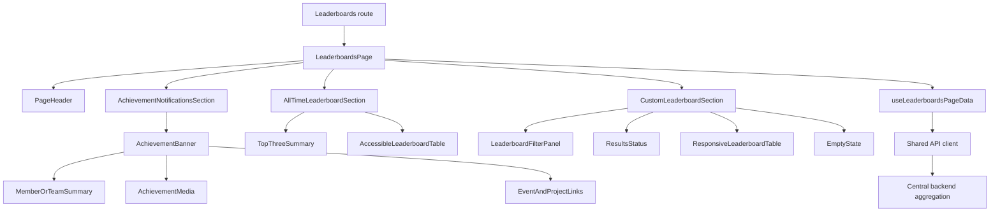
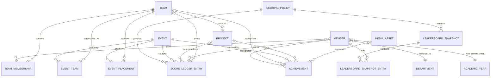

# Leaderboards architecture and implementation guide

## Status and boundaries

This document records the public Leaderboards frontend and its data contract.
The central `backend` area remains responsible for persistence, authorization,
score calculation, ranking, and aggregation. The Leaderboards browser code must
only display server-authoritative scores and public profile fields.

The endpoint names and scoring examples below are contract candidates, not
implemented APIs. After review by the Leaderboards, Events, Projects, Member
Centre, and backend owners, the agreed contract belongs in `packages/contracts`.

## Task 1: Component architecture design



`LeaderboardsPage` owns page-level loading and error boundaries. Each section
receives a purpose-built view model and can render independently. Shared table,
avatar, badge, button, and theme primitives should come from `packages/ui` once
that package is implemented; this service owns only leaderboard compositions.

Suggested source layout when implementation begins:

```text
src/
  components/
    achievements/
      AchievementBanner.tsx
      AchievementNotificationsSection.tsx
    all-time/
      AllTimeLeaderboardSection.tsx
      TopThreeSummary.tsx
    custom/
      CustomLeaderboard.tsx
  data/
    leaderboards.queries.ts
    leaderboards.selectors.ts
  pages/
    LeaderboardsPage.tsx
  models.ts
```

The current boilerplate keeps `CustomLeaderboard.tsx` at the source root until
the repository selects a frontend package layout.

### Layout

1. `AchievementNotificationsSection` is a full-width region containing the
   latest public achievement. The image has meaningful alternative text, and
   Event and Project links are rendered only when their public targets exist.
2. `AllTimeLeaderboardSection` contains an optional top-three summary followed
   by one semantic table. Medal styling is reinforced with rank text so color is
   never the only signal.
3. `CustomLeaderboardSection` contains a labelled filter form, an `aria-live`
   result count, and a horizontally scrollable semantic table on narrow screens.

Each section has independent skeleton, empty, and recoverable error states. A
section failure therefore does not remove the other rankings from the page.

## Task 2: Data models and state management

The complete frontend interfaces are in [src/models.ts](src/models.ts). The key
relationships are:

- `User` exposes only public profile data and references one `Department` and
  one `AcademicYear`.
- `Team` links public member identifiers to one or more Events and Projects.
- `Event` owns final placements and public media metadata, but not member data.
- `Project` references its team and participating Events.
- `Achievement` is an immutable recognition record with a member or team
  subject plus optional public Event and Project navigation targets.
- `LeaderboardEntry` is a read model. Its rank, score, and star rating are
  calculated by the backend and include an `asOf` timestamp and scoring version.

Identifiers are opaque strings. Timestamps use RFC 3339 UTC strings. URLs must
be public HTTPS URLs or application-relative paths. Nullable fields are explicit
so missing media or Project links cannot be confused with an omitted payload.

### Ranking invariants

- `rank` is a positive integer assigned by the backend.
- `achievementScore` is non-negative and follows a versioned scoring policy.
- `starRating` is a display bucket from 0 through 5 derived by the backend.
- Ties, disqualifications, deleted profiles, and score corrections are resolved
  centrally. The browser never infers tie-breaking rules.
- Public responses contain display names and public media only. Email addresses,
  student numbers, private profiles, and unpublished submissions are excluded.

### Central backend logical schema

Leaderboards should extend the shared backend schema, not create copies of
Events, Projects, Teams, Members, Departments, or media assets. The following
is a technology-neutral relational proposal for backend-owner review:



Domain-owned tables remain canonical. The Leaderboards area proposes only these
backend-owned additions:

| Relation | Important fields | Purpose |
| --- | --- | --- |
| `scoring_policy` | `id`, unique `version`, `status`, `rule_definition`, `effective_from`, `effective_to` | Immutable, reviewable scoring and star-threshold definition |
| `score_ledger_entry` | `id`, `source_key`, nullable `member_id`, nullable `team_id`, `event_id`, nullable `project_id`, `policy_id`, `points`, `occurred_at`, nullable `revoked_at` | Append-only score facts with correction history and source idempotency |
| `achievement` | `id`, nullable `member_id`, nullable `team_id`, `event_id`, nullable `project_id`, nullable `position`, `title`, `message`, nullable `image_asset_id`, `achieved_at`, `published_at` | Curated public recognition and CTA context |
| `leaderboard_snapshot` | `id`, `scope`, `filter_hash`, `filter_definition`, `policy_id`, `source_watermark`, `generated_at`, `expires_at` | Reproducible materialization for public reads and cache invalidation |
| `leaderboard_snapshot_entry` | `snapshot_id`, `member_id`, `rank`, `achievement_score`, `star_rating` | Ordered member result for one immutable snapshot |

Required integrity rules:

- Exactly one of `member_id` and `team_id` is present on each ledger entry and
  achievement. Enforce this with a database check constraint, not application
  convention alone.
- `source_key` is unique so retries from Event finalization cannot award points
  twice. Corrections append a compensating entry or revoke a prior fact; they do
  not rewrite audit history.
- `points` and correction behavior follow the attached scoring policy. Snapshot
  scores are non-negative; star ratings are constrained to the inclusive 0-5
  range; ranks and published positions are positive.
- Foreign keys use restrictive deletion for scored domain records. Public
  removal is handled by publication status or tombstoning so historical totals
  remain explainable.
- Only one scoring policy is active for a given effective period. A snapshot
  references one exact policy version and one source watermark.
- Achievement copy is stored because it is editorial and immutable once
  published; names, departments, and academic years are projected from canonical
  Member data according to the agreed historical/current-value policy.

Recommended indexes cover `(event_id, occurred_at)`, `(member_id, occurred_at)`,
`(team_id, occurred_at)`, published achievements by `achieved_at DESC`, snapshots
by `(scope, filter_hash, generated_at DESC)`, and snapshot entries by
`(snapshot_id, rank)`. Measure query plans before adding broader indexes.

The snapshot table is an optimization, not the source of truth. Totals can be
rebuilt from the ledger plus a policy version, which permits audits and safe
recalculation after approved scoring changes.

### Filter state

The four filters form one small local state object:

```ts
interface LeaderboardFilters {
  eventId: string | "all";
  minimumStarRating: 1 | 2 | 3 | 4 | 5 | "all";
  departmentId: string | "all";
  academicYear: string | "all";
}
```

The control panel is controlled by `useState`. One `useMemo` derives visible
rows from the entry array and four scalar filter values. `useCallback` keeps the
reset command stable for child controls. No filtered copy is stored in state,
which avoids synchronization bugs and redundant render cycles.

For a bounded public cohort already loaded by the page, filtering is local and
instant. For large datasets, the same state is serialized into a canonical
query key and sent to the backend; input changes should be debounced, stale
requests aborted, and the previous result retained while the next page loads.
Virtualization is considered only after measurement because it complicates
table semantics and keyboard navigation.

## Task 3: Interactive UI implementation

[src/CustomLeaderboard.tsx](src/CustomLeaderboard.tsx) provides the React
leaderboard section. The integrated route uses shared Fluent UI primitives and
semantic tokens. It includes:

- combinable Event, minimum Star Rating, Department, and Academic Year filters;
- stable, memoized filtering without score recalculation;
- native labelled selects and a reset button;
- loading, error, empty, and populated states;
- a semantic table with a caption, scoped headers, and live result count; and
- horizontal overflow on small screens rather than replacing table semantics
  with inaccessible visual-only cards.

The component consumes semantic tokens from the shared Fluent UI theme and does
not define a parallel local theme.

### Theme token proposal

Midnight Blue and Vanilla define the dark and light surfaces. Gold remains the
repository-required Leaderboards identity for primary actions, selected states,
top-three distinctions, and focus details. Proposed seed values for the shared
theme review are:

| Intent | Light candidate | Dark candidate |
| --- | --- | --- |
| Page surface | Vanilla `#F8F3E3` | Midnight Blue `#081A33` |
| Raised surface | Warm neutral `#FFFCF4` | Blue neutral `#102744` |
| Primary text | Midnight Blue `#081A33` | Vanilla `#FFF8E7` |
| Leaderboards identity | Gold seed `#A15C00` | Accessible gold ramp step |

These are seeds, not component literals. `packages/ui` must generate the Fluent
ramps and validate every semantic pairing to WCAG 2.2 AA in light, dark,
high-contrast, and forced-color modes.

## Task 4: Data integration and aggregation strategy

### Preferred read model

The central backend should expose a public, cacheable Leaderboards read model
rather than requiring the browser to join raw domain payloads. Conceptually:

```ts
interface LeaderboardsPageResponse {
  generatedAt: string;
  scoringPolicyVersion: string;
  recentAchievements: Achievement[];
  allTime: LeaderboardEntry[];
  custom: {
    entries: LeaderboardEntry[];
    options: LeaderboardFilterOptions;
  };
}
```

The backend aggregation flow is:

1. Read published Event metadata, final placements, and approved media.
2. Resolve Project and Team associations using stable identifiers.
3. Resolve only public Member profile projections for each team.
4. Apply the agreed, versioned scoring and tie-breaking policy.
5. Produce immutable achievement records and denormalized leaderboard rows.
6. Remove private, draft, moderated, or otherwise non-public records.
7. Return `generatedAt`, scoring-policy version, pagination metadata when needed,
   and an HTTP cache validator such as `ETag`.

This keeps cross-domain consistency, privacy enforcement, and ranking logic out
of the browser. The read model can be refreshed transactionally after an Event
is finalized or rebuilt asynchronously when scores change.

### Fallback client merge

If backend aggregation is temporarily unavailable, fetch public domain payloads
in parallel with `Promise.allSettled`. Normalize each payload into `Map<string,
Entity>` indexes, then join by identifiers in linear time. Preserve partial
success: for example, show a ranking row without an avatar when media fails, but
do not synthesize a score when a ranking source fails. Report incomplete data in
the section status and provide a retry command.

This fallback is transitional. It increases payload size, consistency risk, and
the chance of exposing fields that the page does not need.

### Fetching and caching

- Use the shared API client for transport. Add a shared query/cache library only
  when measured request volume justifies its dependency and lifecycle cost.
- Key custom results by a canonical tuple of Event, minimum star rating,
  Department, Academic Year, cursor, and scoring-policy version.
- Cache public aggregate responses at the CDN and browser using `ETag` and a
  short `max-age` with `stale-while-revalidate`. Invalidate or version them when
  an Event is finalized or a correction is published.
- Request media at responsive sizes and lazy-load noncritical images. Preserve
  dimensions to prevent layout shift.
- Paginate server-side before payloads become large. Return total result count
  separately so the live region remains useful.

### State behavior

| State | Expected presentation |
| --- | --- |
| Initial loading | Stable table/section skeleton with a textual status |
| Filter refresh | Keep previous rows, mark results busy, disable only unsafe actions |
| Partial data | Render valid public fields and identify unavailable context |
| Empty | Explain that no rankings match and offer filter reset |
| Recoverable error | Keep successful sections and expose a retry button |
| Stale cache | Show cached data with its `asOf` time while refreshing |

## Contract decisions required before backend implementation

1. Formal scoring, star thresholds, tie-breaking, correction, and season rules.
2. Whether custom filters produce cohort-relative ranks or preserve global rank.
3. Academic-year vocabulary and behavior when a member changes year.
4. Team membership effective dates and attribution for former members.
5. Publication/moderation rules for names, photos, Events, and Projects.
6. Pagination, maximum page size, caching duration, and freshness target.
7. Canonical route identifiers for Event and Project calls to action.
8. Accessibility copy and image fallback policy.

## Validation plan

After the frontend stack is selected, add component tests for every filter alone
and in combination, reset behavior, top-three labels, loading/error/empty states,
keyboard operation, and accessible names. Run automated accessibility checks and
inspect representative mobile and desktop widths in light, dark, system,
reduced-motion, high-contrast, and 200% zoom modes.